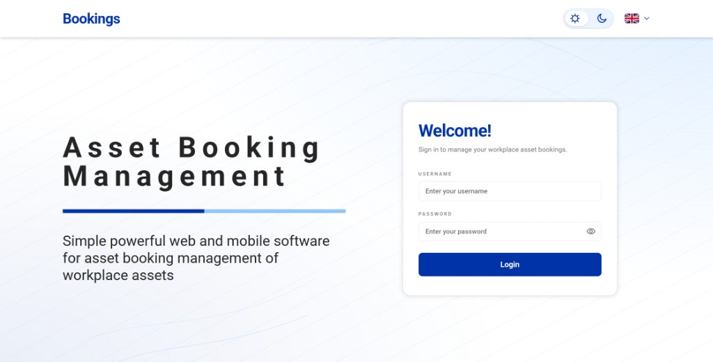
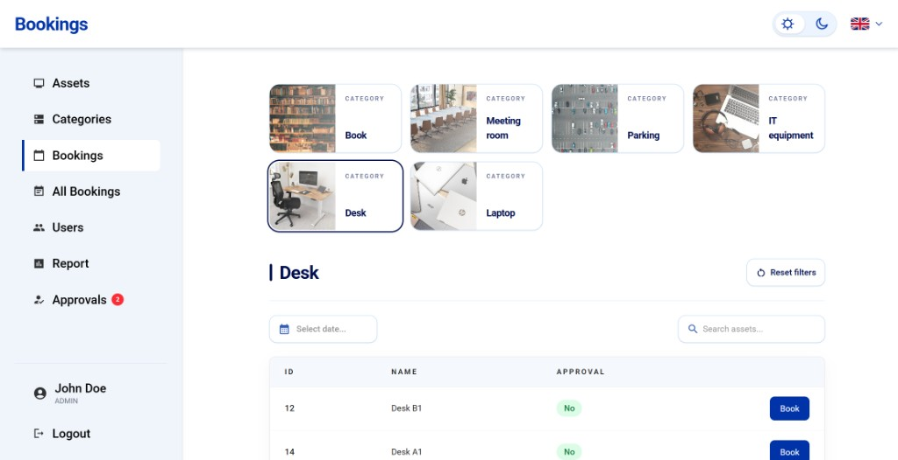
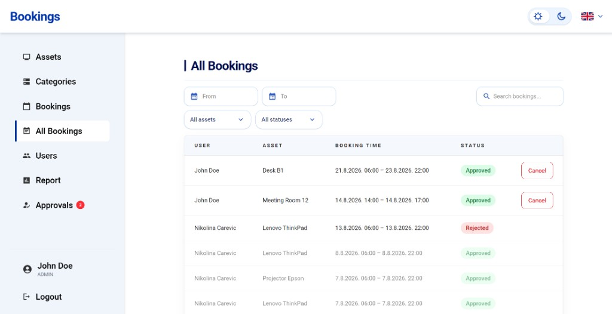
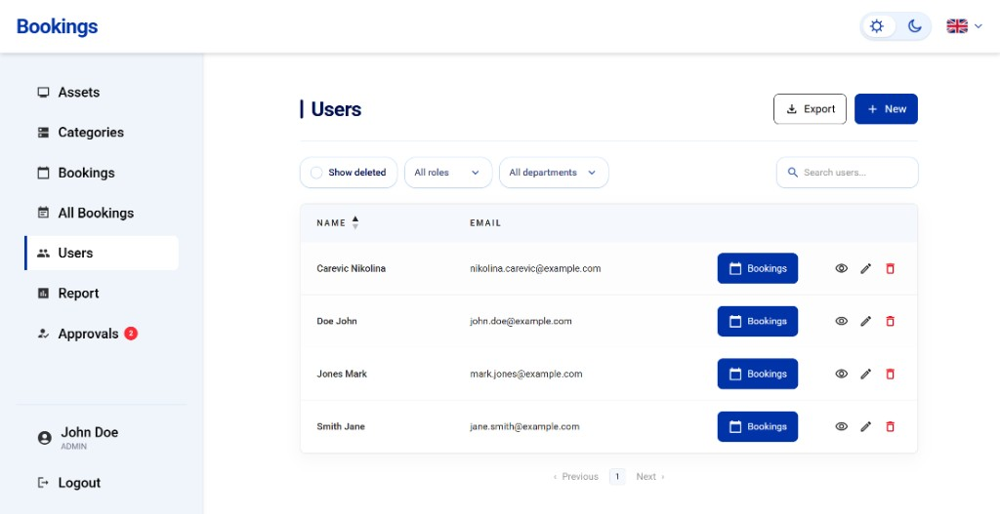
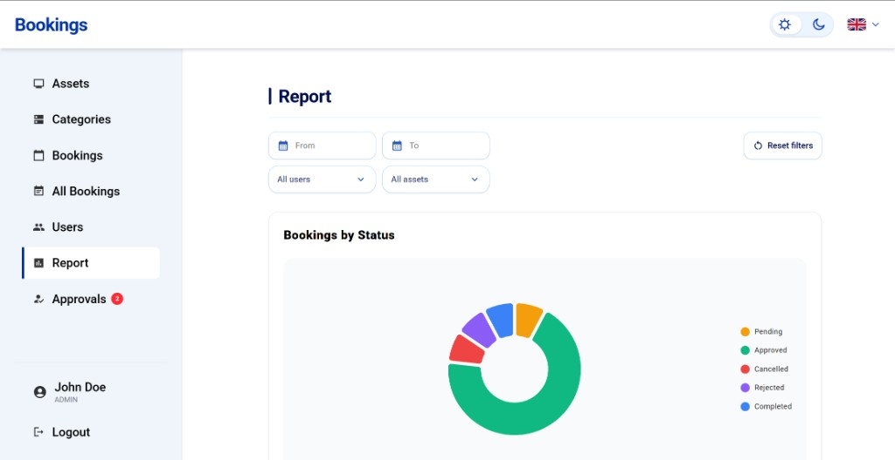
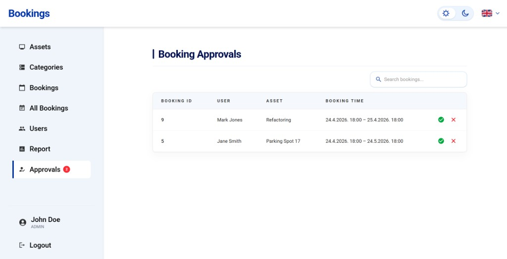
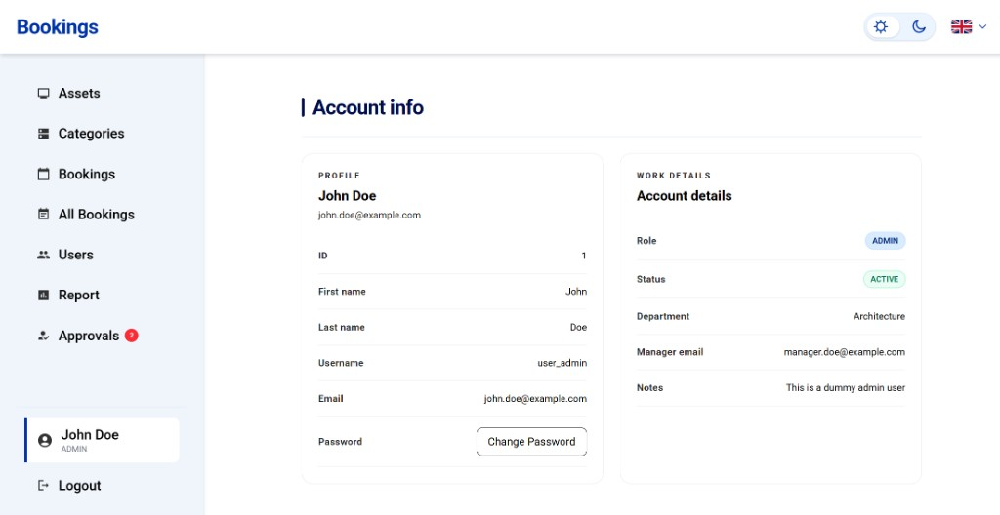

# Asset Booking Management

Web and mobile system for booking and managing workplace assets (desks, parking spots, meeting rooms, shared devices, and more).

## Features

- Book workplace assets and prevent double bookings
- Reserve parking spots, meeting rooms, and hot desks
- QR code booking via mobile app
- Real-time visibility of assets and bookings
- Usage reports

## Stack

- **Frontend:** React + Vite + TypeScript
- **Backend:** Spring Boot (Java 21)
- **Database:** PostgreSQL 18
- **API:** [OpenAPI spec](openapi/assetBookingManagementOpenAPISpec.yaml)

## Local setup

### Requirements

- Docker
- Docker Compose

Copy `sample.env` to `.env` and adjust values if needed. Frontend uses `frontend/.env` (see `frontend/sample.env`).

### Dev (recommended)

```bash
docker compose -f compose.yaml -f compose.dev.yaml up --build
```

| Service  | URL |
|----------|-----|
| Frontend | http://localhost:5173 |
| Backend  | http://localhost:8080 |
| Swagger  | http://localhost:8080/swagger-ui.html |

Stop:

```bash
docker compose -f compose.yaml -f compose.dev.yaml down
```

Clean volumes:

```bash
docker compose -f compose.yaml -f compose.dev.yaml down -v --remove-orphans
```

If you have `make` installed, the same commands are available as `make dev`, `make dev-down`, and `make dev-clean`.

### Production-like run

```bash
docker compose up --build
```

### Only the database

```bash
docker compose up db
```

## Environment variables

```bash
DB_HOST=db
DB_PORT=5432
DB_NAME=database_name_here
DB_USER=db_user_here
DB_PASSWORD=db_password_here

SPRING_PROFILES_ACTIVE=dev

# JWT secret must be at least 32 characters
JWT_SECRET=12345678901234567890123456789012
JWT_EXPIRY_SECONDS=300
JWT_REFRESH_SECONDS=3600
```

| Variable | Description |
|----------|-------------|
| `DB_HOST` | Database service name in Compose (keep `db`) |
| `DB_PORT` | PostgreSQL port (default `5432`) |
| `DB_NAME` / `DB_USER` / `DB_PASSWORD` | Database credentials |
| `SPRING_PROFILES_ACTIVE` | Spring profile (`dev` for local) |
| `JWT_SECRET` | JWT signing key (≥ 32 chars) |
| `JWT_EXPIRY_SECONDS` | Access token lifetime |
| `JWT_REFRESH_SECONDS` | Refresh token lifetime |

## Project structure

| Path | Description |
|------|-------------|
| [`backend/`](backend/) | Spring Boot API |
| [`frontend/`](frontend/) | React web app |
| [`mobile/`](mobile/) | Mobile apps (Android / iOS) |
| [`openapi/`](openapi/) | OpenAPI specification |
| [`tests/`](tests/) | API / e2e / load tests |
| [`compose.yaml`](compose.yaml) | Docker Compose services |

## API testing (Bruno)

1. Install [Bruno](https://www.usebruno.com/downloads)
2. Open collection: `tests/api-tests/bruno/`
3. Select the **development** environment
4. Start the app, then run requests against the local API

## Screenshots

### Login



### Bookings



### All bookings



### Users



### Report



### Approvals



### Account info


